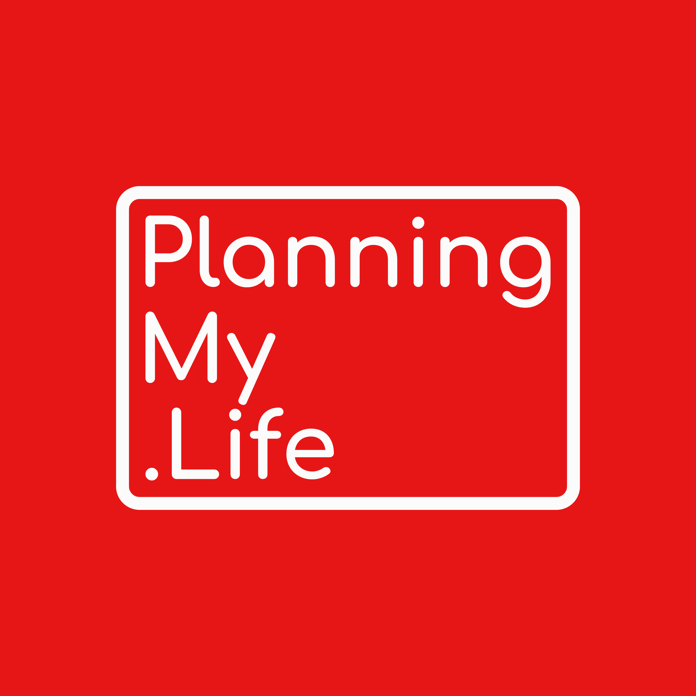

<link rel="stylesheet" href="../style.css">

<header>
  
</header>

<nav>
  <ul>
    <li><a href="../index.html">Home</a></li>
    <li><a href="../Guides/">Guides</a></li>
    <li><a href="../Worksheets/">Worksheets</a></li>
    <li><a href="../Templates/">Templates</a></li>
    <li><a href="../Public-Resources/">Resources</a></li>
  </ul>
</nav>

# Guides

Explore the foundations of life planning and the GAME Plan framework.

- [What is Life Planning?](./What-is-Life-Planning.html)  
- [The GAME Plan](./The-GAME-Plan.html)  
- <a href="./Knights_of_Aquarius_Code_of_Chivalry.pdf" target="_blank">Knights of Aquarius: Code of Chivalry (PDF)</a>
