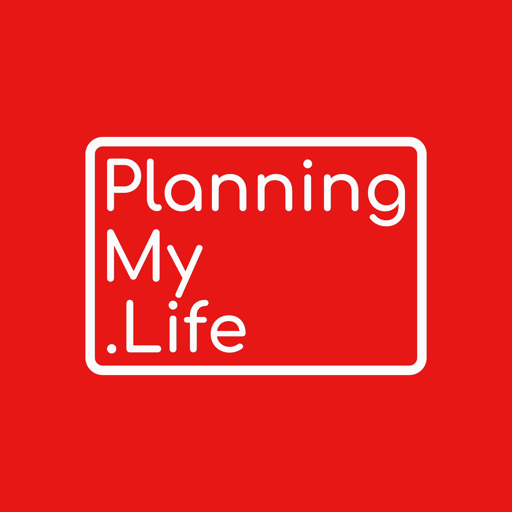

<link rel="stylesheet" href="../style.css">
<header>
  
</header>

<nav>
  <ul>
    <li><a href="../index.html">Home</a></li>
    <li><a href="../Guides/">Guides</a></li>
    <li><a href="../Worksheets/">Worksheets</a></li>
    <li><a href="../Templates/">Templates</a></li>
    <li><a href="../Public-Resources/">Resources</a></li>
  </ul>
</nav>

# Execution Review

**Review Period:** (Week / Month / Quarter)

---

## What went well?
- ___________________________________

## What needs attention?
- ___________________________________

---

## Key Metrics
- Habits sustained: ___
- Goals advanced: ___
- Progress with Means (time, skills, money): ___

---

## Next Cycle Focus
- ___________________________________
